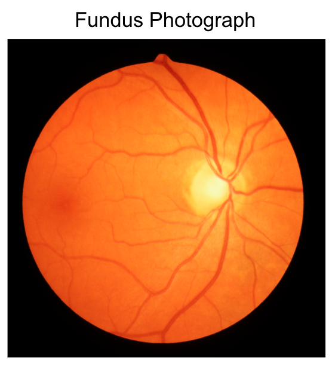
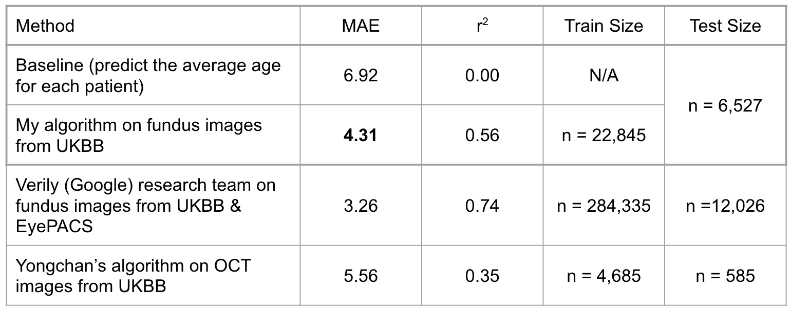
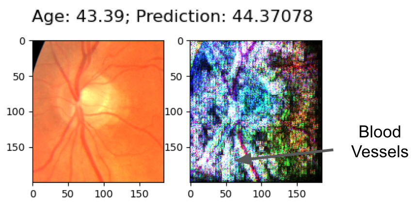
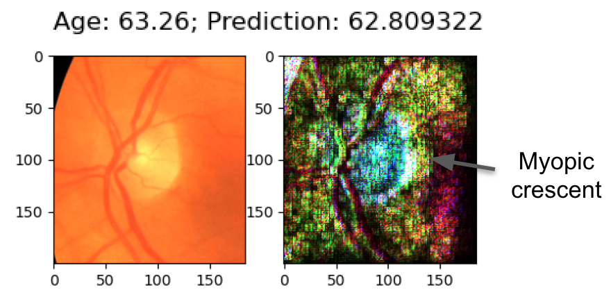

(This is a copy of my original project. Data files have been removed to protect the privacy of Rivas Lab and UKBB.)

# Fundus Project
  
This project demonstrates that a computer can predict the age of a patient based on an image of his/her retina.

<p align="center">


See this presentation for more information on the project: [Fundus Project Presentation][1]

   [1]: https://docs.google.com/presentation/d/1-WRHCdPuX4GXmXYIgDkO7TTMbHjSon7ZZb0F-9Fs66s/edit?usp=sharing

#### Results

<p align="center">


MAE = mean absolute error

#### Directory Structure
* `py_files/`: `.py` files to train, test, and explain the model (instructions below)
* `scripts/`: Scripts to run the above `.py` files on the Sherlock computing system
* `data/`: Data used by the model
* `images/`: Outputs from the model (train loss plot, prediction scatter plot, explanation visualizations); `README` images
* `models/`: Model weights output from training

#### Instructions to run this code

1. Setup the conda environment `age` using the following commands.
```
conda create -n age python=3.6
conda activate age
pip install alibi
pip install tensorflow-gpu
```

Environment specifications:
```
alibi                     0.5.4
matplotlib                3.3.1
numpy                     1.18.5
pandas                    1.1.1
pillow                    7.2.0
python                    3.6.10
scipy                     1.4.1
tensorflow                2.3.0
tensorflow-gpu            2.3.0
```

2. Train the model by running `sbatch train.sh` in `scripts/`:
* This script runs `py_files/train.py`
* Model weights will be saved to `model/`
* Loss history plot will be saved to `images/loss_plot.png`

3. Test the model by (1) replacing the weights file in `load_dense_nn_regression()` (in `py_files/model_utils`) with the latest callback in `models/` and (2) running `sbatch test.sh` in `scripts/`:
* This script runs `py_files/test.py`
* Prediction scatter plot will be printed to `images/scatter.png`
* Test accuracy will be printed to the command line. Sample output:
```
Baseline MAE: 6.92
Prediction MAE: 4.31
Baseline r-squared:  0.00
Prediction r-squared:  0.56
```
4. Generate explanations by running `sbatch explain.sh in `scripts/``
* This script runs `py_files/explain.py`
* Explanations will be saved to `images/explanations/`.

#### How to interpret explanations

Explanations were generated by the Integrated Gradients method from the Alibi library: http://proceedings.mlr.press/v70/sundararajan17a/sundararajan17a.pdf

The color of each pixel represents the importance of that pixel to the model's prediction. White is the highest value. Black is the lowest. A higher value means that the pixel was important in causing the model to make a prediction that is higher or lower than the mean.

##### Examples

Here, the model predicted a *lower* than average age, and the most important pixels were those around the blood vessels below the optic disc:

<p align="center">


Here, the model predicted a *higher* than average age, and the most important pixels were those in the myopic crescent next to the optic disc:

<p align="center">

