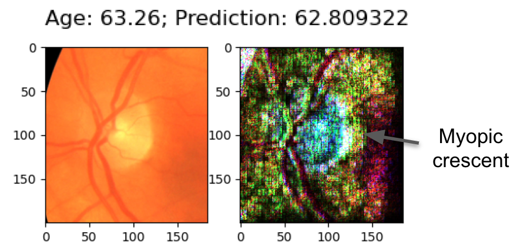

### How to interpret explanations

Explanations were generated by the Integrated Gradients method from the Alibi library: https://docs.seldon.io/projects/alibi/en/stable/methods/IntegratedGradients.html

The color of each pixel represents the importance of that pixel to the model's prediction. White is the highest value. Black is the lowest. A higher value means that the pixel was important in causing the model to make a prediction that is higher or lower than the mean.

#### Examples

Here, the model predicted a *lower* than average age, and the most important pixels were those around the blood vessels below the optic disc:

Here, the model predicted a *higher* than average age, and the most important pixels were those in the myopic crescent next to the optic disc:

